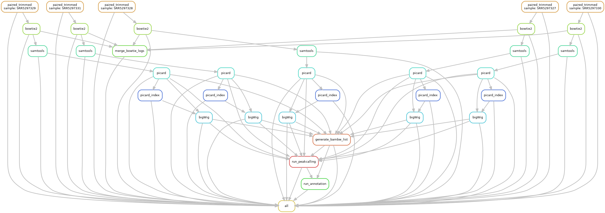

# CHIP-seq Analysis Pipeline



## Overview
This pipeline provides a comprehensive solution for ChIP-seq data analysis, from promoter_plot to TF_motif_plot_down. Utilizing the Snakemake workflow management system, it ensures reproducibility and efficiency throughout the analysis process.

## Quick Start Guide

### 1. Input File Preparation

-   **Supported formats:**
    -   Compressed (`.fastq.gz`) or uncompressed (`.fastq`) FASTQ files
    -   Both single-end and paired-end sequencing data
-   **Directory structure:**
    Place all input files in:
    ```
    data/CHIPPROJ/fastqfile/
    ```

---

### 2. Workflow Configuration

Modify parameters in [data/CHIPPROJ/config.yaml](data/CHIPPROJ/config.yaml) as follows:

#### System Configuration
-   **`conda_install_path`**:
    Path to your Conda installation (e.g., `/home/user/miniconda3`)

#### Reference Genome
-   **`indexdir`**:
    Directory containing Bowtie2 genome indices (mouse or human)

#### Computational Resources
-   **Thread allocation:**
    ```yaml
    threads:
      trim_galore: 4    # Quality control
      bowtie2: 4        # Sequence alignment  
      samtools: 4       # SAM/BAM processing
      bigWig: 5         # BigWig file generation
    ```
    *Adjust thread numbers based on available computational resources*

#### Picard Parameters
-   **`java_mem`**:
    JVM maximum heap size (e.g., `-Xmx15g` for 15GB)
-   **`remove_dups`**:
    Set to `"true"` to remove PCR duplicates (recommended)
-   **`picarddir`**:
    Path to Picard installation directory (usually no modification needed)

#### Macs2 Peak Calling Parameters

> **Naming Convention:** Biological replicates must follow the `groupname_repX` pattern, where:
> - `groupname`: Your custom identifier for the sample group
> - `X`: Replicate number (must be sequential starting from 1)
> - Example: For three replicates: `groupname_rep1`, `groupname_rep2`, `groupname_rep3`

**Required parameters for each sample group:**
-   **`treat_bam`**: Treatment sample SRR ID
-   **`control_bam`**: Control sample SRR ID
-   **`genome`**: Reference genome (`mm` for mouse, `hg` for human)
-   **`qval`**: FDR cutoff for peak calling (default: 0.05)

**Configuration Example:**
```yaml
Macs2:
  mESC_18h_DOX_rep1:
    treat_bam: SRR5297329
    control_bam: SRR5297331
    genome: mm
    qval: 0.05

  mESC_18h_DOX_rep2:
    treat_bam: SRR5297330
    control_bam: SRR5297331
    genome: mm
    qval: 0.05

  mESC_18h_DOX_rep3:
    treat_bam: SRR5297332
    control_bam: SRR5297331
    genome: mm
    qval: 0.05
```

#### Experimental Group Assignment

> **Important:** Group names must match those defined in the Macs2 section (without `_repX` suffix) and correctly assign samples to experimental conditions.

**Group designation:**
- **`P`**: Treatment group
- **`T`**: Control group

**Configuration Example:**
```yaml
groupnames:
  mESC_18h_DOX: P    # Treatment group
  mESC_12h_DOX: T    # Control group

# Group list (note: space required after dash)
groups:  
  - mESC_18h_DOX
  - mESC_12h_DOX
```

---

### 3. Workflow Execution

1.  **Test configuration (dry run):**
    ```bash
    snakemake --snakefile data/CHIPPROJ/snakefile --configfile data/CHIPPROJ/config.yaml -n -p
    ```
2.  **Execute pipeline:**
    ```bash
    nohup snakemake --snakefile data/CHIPPROJ/snakefile --configfile data/CHIPPROJ/config.yaml -j <N> > log_chipseq.txt 2>&1 &
    ```
    Where `<N>` = number of CPU threads to use

---

## Configuration Template

### `data/CHIPPROJ/config.yaml`
```yaml

# Your conda.sh path:{conda_install_path}/etc/profile.d/conda.sh
conda_install_path: /home/yxiaobo/miniconda3    ## Enter the prefix path of your Miniconda installation {conda_install_path}

# Reference genome configuration
genome:
  indexdir: "reference/bowtie2_index/mousebowtie2Index/GRCm38"         ## Path to the bowtie2 reference genome index directory (mouse or human) from reference

# Thread configuration (Numbers indicate CPU cores used by different rules in the CHIPPROJ Snakefile; adjust based on available resources)
threads:
  trim_galore: 4  ## Quality control threads 
  bowtie2: 4      ## Alignment threads
  samtools: 4     ## SAM/BAM conversion and sorting threads
  bigWig: 5       ## BigWig file generation threads

# Picard deduplication parameters
picard:
  java_mem: "-Xmx15g"  ## JVM maximum heap size set to 15GB (adjust based on available memory)
  remove_dups: "true"  ## Whether to remove duplicate reads: "true"/"false" (recommended: "true")
  picarddir: "reference/picard-2.18.2"  ### Picard installation directory (usually no need to change)

# Macs2 group parameters (groupname_repx, treat_bam, control_bam, genome, qval (0.05 default))
# Note: For biological replicates of the same sample group, naming must strictly follow groupname_repx pattern.
# If a sample has N biological replicates, the sequence numbers must increment from 1 to N
# (e.g., for three replicates: groupname_rep1, groupname_rep2, groupname_rep3)
Macs2:
  mESC_18h_DOX_rep1:        ## Name each of your experimental and control sample groups {groupname_repx}
    treat_bam: SRR5297329   ## Enter your treatment group SRR ID
    control_bam: SRR5297331 ## Enter your control group SRR ID
    genome: mm              ## Select your species: mm (mouse) or hg (human)
    qval: 0.05              ## Select the p-value threshold you want to use

  mESC_18h_DOX_rep2:    
    treat_bam: SRR5297330
    control_bam: SRR5297331
    genome: mm
    qval: 0.05
  
  mESC_12h_DOX_rep1:
    treat_bam: SRR5297327
    control_bam: SRR5297331
    genome: mm
    qval: 0.05

  mESC_12h_DOX_rep2:
    treat_bam: SRR5297328
    control_bam: SRR5297331
    genome: mm
    qval: 0.05
 
# Sample grouping - Remove repx and assign samples to experimental and control groups correctly
groupnames:      
  mESC_18h_DOX: P    ## P for treatment group
  mESC_12h_DOX: T    ## T for control group

# Group list corresponding to groupnames configuration (Note: a space is required after the dash)
groups:  
  - mESC_18h_DOX 
  - mESC_12h_DOX

```

---

## Input/Output Specifications

### Input Files
Example paired-end input structure:
```
data/CHIPPROJ/fastqfile/
├── SRR5297327_1.fastq
├── SRR5297327_2.fastq
├── SRR5297328_1.fastq
├── SRR5297328_2.fastq
├── SRR5297329_1.fastq
├── SRR5297329_2.fastq
├── SRR5297330_1.fastq
├── SRR5297330_2.fastq
├── SRR5297331_1.fastq
└── SRR5297331_2.fastq
```

### Key Output Files

#### Alignment Metrics
-   **`bowtie.log`**:
    ```
    43654791 reads; of these:
      43654791 (100.00%) were paired; of these:
        4964416 (11.37%) aligned concordantly 0 times
        26507323 (60.72%) aligned concordantly exactly 1 time
        12183052 (27.91%) aligned concordantly >1 times
    ```

#### BAM Quality Control Files
-   **`mESC_18h_DOX_rep1_cross.txt`**:
    ```
    SRR5297329_sorted.unique.bam	61209916	205	0.516774114241719	130	0.5008096	1500	0.4338863	1.191036	1.23855	1
    ```

#### Peak Annotation Results
-   **`promoter_peaks.csv`**:
    ```
    "seqnames","start","end","width","strand","V4","V5","V6","annotation","geneChr","geneStart","geneEnd","geneLength","geneStrand","geneId","transcriptId","distanceToTSS","ENSEMBL","SYMBOL","GENENAME"
    "chr1",9628838,9629172,335,"*","mESC_12h_DOX_rep1_peak_205",160,".","Promoter",1,9560832,9631092,70261,2,"72481","ENSMUST00000115480.7",1920,NA,"2610203C22Rik","RIKEN cDNA 2610203C22 gene"
    ```

#### Visualization Outputs 
- **`Bowtie2_result_bar_plot.pdf`**:  
  Bar plot showing mapping percentages

---


## Complete Output File Reference

The following table provides a comprehensive list of all output files generated by the pipeline:

| File Name | Directory | Description | Tool/Source |
| :--- | :--- | :--- | :--- |
| `{sample}_1_val_1.fq.gz` (paired) | `data/CHIPPROJ/QCfile` | Trimmed reads 1 | trim_galore |
| `{sample}_2_val_2.fq.gz` (paired) | `data/CHIPPROJ/QCfile` | Trimmed reads 2 | trim_galore |
| `{sample}_1_val_1_fastqc.html` (paired) | `data/CHIPPROJ/QCfile` | FastQC report 1 | trim_galore |
| `{sample}_2_val_2_fastqc.html` (paired) | `data/CHIPPROJ/QCfile` | FastQC report 2 | trim_galore |
| `{sample}_1_val_1_fastqc.zip` (paired) | `data/CHIPPROJ/QCfile` | FastQC data 1 | trim_galore |
| `{sample}_2_val_2_fastqc.zip` (paired) | `data/CHIPPROJ/QCfile` | FastQC data 2 | trim_galore |
| `{sample}_1.fastq_trimming_report.txt` (paired) | `data/CHIPPROJ/QCfile` | Trimming report 1 | trim_galore |
| `{sample}_2.fastq_trimming_report.txt` (paired) | `data/CHIPPROJ/QCfile` | Trimming report 2 | trim_galore |
| `{sample}_1_trimmed.fq.gz` (single) | `data/CHIPPROJ/QCfile` | Trimmed reads (SE) | trim_galore |
| `{sample}_1_trimmed_fastqc.html` (single) | `data/CHIPPROJ/QCfile` | FastQC report (SE) | trim_galore |
| `{sample}_1_trimmed_fastqc.zip` (single) | `data/CHIPPROJ/QCfile` | FastQC data (SE) | trim_galore |
| `{sample}_1.fastq_trimming_report.txt` (single) | `data/CHIPPROJ/QCfile` | Trimming report (SE) | trim_galore |
| `{sample}.sam` | `data/CHIPPROJ/bam_bwfile` | Alignment file (SAM) | bowtie2 |
| `bowtie.log` | `data/CHIPPROJ` | Alignment statistics log | snakefile |
| `{sample}_sorted.bam` | `data/CHIPPROJ/bam_bwfile` | Sorted alignment file (BAM) | samtools |
| `{sample}_sorted.unique.bam` | `data/CHIPPROJ/bam_bwfile` | Deduplicated BAM file | picard |
| `{sample}_sorted.unique.bam.bai` | `data/CHIPPROJ/bam_bwfile` | BAM index file | samtools |
| `{sample}.metricsFile` | `data/CHIPPROJ/bam_bwfile` | Picard metrics file | picard |
| `{sample}.bw` | `data/CHIPPROJ/bam_bwfile` | BigWig coverage file | bamCoverage |
| `bambw_list.yaml` | `data/CHIPPROJ/bam_bwfile` | Configuration file linking groups | snakefile |
| `{groupname_repx}_summits.bed` | `data/CHIPPROJ/Macs2/{groupname_repx}` | Peak summit locations | MACS2 |
| `{groupname_repx}_peaks_tab.bed` | `data/CHIPPROJ/Macs2/{groupname_repx}` | Tab-separated BED format peaks | MACS2 |
| `{groupname_repx}_peaks.xls` | `data/CHIPPROJ/Macs2/{groupname_repx}` | MACS2 peak calling results | MACS2 |
| `{groupname_repx}_peaks.narrowPeak` | `data/CHIPPROJ/Macs2/{groupname_repx}` | Standard narrowPeak format | MACS2 |
| `{groupname_repx}_peaks.bed` | `data/CHIPPROJ/Macs2/{groupname_repx}` | Simplified BED format peaks | MACS2 |
| `{groupname_repx}_model.r` | `data/CHIPPROJ/Macs2/{groupname_repx}` | MACS2 model script | MACS2 |
| `{groupname_repx}_cross.txt` | `data/CHIPPROJ/Macs2/{groupname_repx}/bam_control` | SPP cross-correlation results | SPP |
| `{groupname}_matrix.gz` | `data/CHIPPROJ/Macs2/{groupname}` | Compressed matrix file | deepTools |
| `{groupname}_matrix_values.tab` | `data/CHIPPROJ/Macs2/{groupname}` | Matrix value table | deepTools |
| `promoter_peaks.csv` | `data/CHIPPROJ/annotations/{groupname}` | Peaks annotated as promoters | ChIPseeker |
| `peak_anno.csv` | `data/CHIPPROJ/annotations/{groupname}` | Complete peak annotation data | ChIPseeker |
| `{groupname}_merged_peaks_tab.bed` | `data/CHIPPROJ/annotations/{groupname}` | Merged BED file per group | annoChIPPeaks.R |
| `{groupname_repx}_bam_control.q0.05.pdf` | `data/CHIPPROJ/picture` | Quality control plot | SPP |
| `{groupname}_annotation_plot.pdf` | `data/CHIPPROJ/pdf_plots` | Genomic feature distribution pie chart | ChIPseeker |
| `Bowtie2_result_bar_plot.pdf` | `data/CHIPPROJ/pdf_plots` | Mapping percentages bar plot | annoChIPPeaks.R |

---

## Tools Used in Pipeline

| Tool | Purpose | Documentation |
| :--- | :--- | :--- |
| **Trim Galore** | Quality control and adapter trimming | [Link](https://www.bioinformatics.babraham.ac.uk/projects/trim_galore/) |
| **Bowtie2** | Sequence alignment | [Link](https://bowtie-bio.sourceforge.net/bowtie2/index.shtml) |
| **Samtools** | SAM/BAM file processing | [Link](https://www.htslib.org) |
| **Picard** | Duplicate marking and removal | [Link](https://broadinstitute.github.io/picard/) |
| **bamCoverage** | BigWig coverage file generation | [Link](https://deeptools.readthedocs.io/en/latest/content/tools/bamCoverage.html) |
| **MACS2** | Peak calling | [Link](https://github.com/taoliu/MACS) |
| **SPP** | Quality assessment and cross-correlation analysis | [Link](https://github.com/hms-dbmi/spp) |
| **deepTools** | Signal visualization and matrix analysis | [Link](https://deeptools.readthedocs.io/) |
| **ChIPseeker** | Peak annotation and genomic feature analysis | [Link](https://bioconductor.org/packages/release/bioc/html/ChIPseeker.html) |
| **annoChIPPeaks.R** | ChIP-seq peak annotation analysis | [Link](data/CHIPPROJ/scripts/annoChIPPeaks.R) |
| **snakefile** | CHIP-seq analysis workflow automation | [Link](data/CHIPPROJ/snakefile) |
| **peakcalling_script.pl** | Peak calling for ChIP-seq data | [Link](data/CHIPPROJ/scripts/peakcalling_script.pl) |
| **snakefile** | CHIP-seq analysis workflow automation | [Link](data/CHIPPROJ/snakefile) |

---

## Reference Data
All required reference files are documented in the [reference](/reference).
