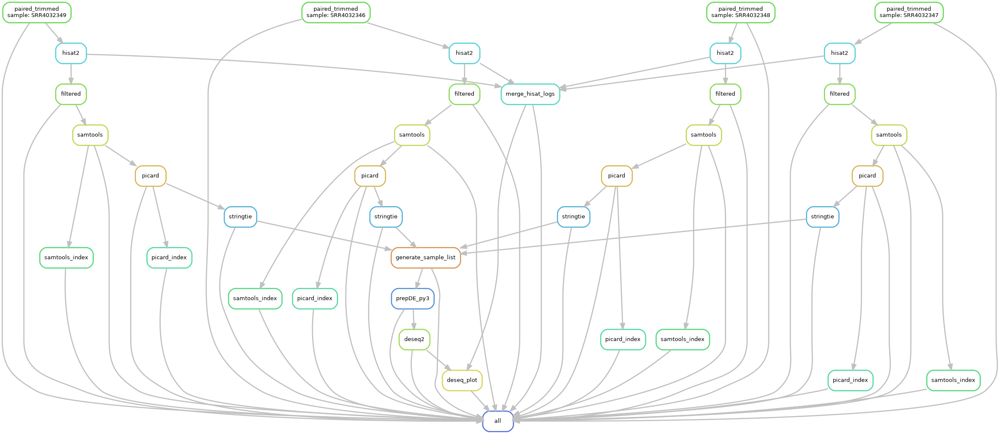

# RNA-seq Analysis Pipeline



## Overview

This pipeline provides a comprehensive solution for RNA-seq data analysis, from raw sequencing data to identification and visualization of differentially expressed genes. Utilizing the Snakemake workflow management system, it ensures reproducibility and efficiency throughout the analysis process.

## Quick Start Guide

### 1. Input File Preparation

- **Supported Formats:**
  - Compressed (`.fastq.gz`) or uncompressed (`.fastq`) FASTQ files
  - Both single-end and paired-end sequencing data
- **Directory Structure:**
  Place all input files in:
  ```
  data/RNAPROJ/fastqfile/
  ```

### 2. Workflow Configuration

Modify analysis parameters in [data/RNAPROJ/config.yaml](data/RNAPROJ/config.yaml) as follows::

#### System Configuration
- **`conda_install_path`**:
  Absolute path to your Conda installation directory (e.g., `/home/user/miniconda3`). This should point to the prefix path where Miniconda is installed, as the workflow requires access to `{conda_install_path}/etc/profile.d/conda.sh`.

#### Reference Genome Configuration
- **`genome.indexdir`**:
  Directory containing pre-built HISAT2 genome indices (e.g., `reference/hisat2_index/mousehisat2Index/GRCm38` for mouse genome GRCm38)
- **`genome.gfffile`**:
  Path to gene annotation file in GTF format (required for StringTie transcript assembly). Default: `/home/yxiaobo/APIARC3/reference/annotation/gencode.vM25.annotation.gtf` for mouse (vM25); use v44 for human
- **`genome.bed_path`**:
  Path to species-specific annotation file in BED format. Default: `reference/gencode.vM25.mRNA.annotation.bed` for mouse (vM25); use v44 for human

#### Computational Resources
- **Thread Allocation:**
  ```yaml
  threads:
    trim_galore: 4    # CPU cores for quality control and adapter trimming
    hisat2: 4         # CPU cores for genome alignment
    samtools: 4       # CPU cores for SAM/BAM conversion and sorting
    stringtie: 5      # CPU cores for transcript assembly
  ```
  *Adjust these values based on your available computational resources*

#### Picard Parameters
- **`picard.java_mem`**:
  JVM maximum heap size specification (e.g., `-Xmx15g`). Adjust based on available system memory
- **`picard.remove_dups`**:
  Set to `"true"` to enable duplicate read removal (recommended), `"false"` to skip this step
- **`picard.picarddir`**:
  Path to Picard tools installation directory (default: `reference/picard-2.18.2`)

#### Sample Metadata
- **Sample Naming Convention:**
  ```yaml
  names:
    mESC_24h_DOX_1: SRR4032346  # Format: descriptive_sample_name: SRA_accession_number
    mESC_24h_DOX_2: SRR4032347
    mESC_no_DOX_1: SRR4032348
    mESC_no_DOX_2: SRR4032349
  ```
  *Modify or add/remove entries according to your experimental samples*

- **Experimental Design:**
  ```yaml
  group:
    sample_IDs:
      mESC_24h_DOX_1: P  # P = Treatment/Experimental group
      mESC_24h_DOX_2: P  # T = Control/Reference group
      mESC_no_DOX_1: T   
      mESC_no_DOX_2: T
  ```
  *Group names must exactly match those defined in the 'names' section*

**Important Notes:**
- Ensure all file paths are absolute paths or relative to the project root directory
- The reference genome files (index, GTF, BED) should be prepared in advance
- Adjust memory (`java_mem`) and thread settings according to your system resources
- Sample names in `names` and `group` sections must be consistent for proper analysis
  ```

### 3. Workflow Execution

1. **Test Configuration (Dry Run):**
   ```bash
   snakemake --snakefile data/RNAPROJ/snakefile --configfile data/RNAPROJ/config.yaml -n -p
   ```

2. **Execute Pipeline:**
   ```bash
   nohup snakemake --snakefile data/RNAPROJ/snakefile --configfile data/RNAPROJ/config.yaml -j <N> > log_rna.txt 2>&1 &
   ```
   Where `<N>` = number of CPU threads to use

---

## Configuration Template

### `data/RNAPROJ/config.yaml`
```yaml

# Path to your conda.sh: {conda_install_path}/etc/profile.d/conda.sh
conda_install_path: /home/yxiaobo/miniconda3        ## Enter the prefix path of your Miniconda installation

# Reference genome configuration
genome:
  indexdir: "reference/hisata2_index/mousehisat2Index/GRCm38"       ## Path to the HISAT2 reference genome index (mouse or human)
  gfffile: "reference/gencode.vM25.RNA.annotation.gtf"             ## Path to the StringTie reference annotation file (GTF format, usually no need to change)
  bed_path: "reference/gencode.vM25.mRNA.annotation.bed"           ## Path to the gene annotation file (BED format) for mouse (vM25) or human (v44)

# Thread configuration (Numbers indicate CPU cores used by different rules in the RNAPROJ Snakefile; adjust based on available resources)
threads:
  trim_galore: 4  ## Quality control threads
  hisat2: 4       ## Alignment threads
  samtools: 4     ## SAM/BAM conversion and sorting threads
  stringtie: 5    ## Transcript assembly threads

# Deduplication parameters
picard:
  java_mem: "-Xmx15g"  ## JVM maximum heap memory set to 15GB (adjust based on available memory)
  remove_dups: "true"  ## Whether to remove duplicate reads: "true" or "false" (recommended: "true")
  picarddir: "reference/picard-2.18.2"  ### Picard installation directory path (usually no need to change)

# Sample list generation
names:                        
  mESC_24h_DOX_1: SRR4032346  ## Mapping of group names (e.g., mESC_24h_DOX_1) to sample SRR IDs (e.g., SRR4032346). Modify or add/remove entries as needed.
  mESC_24h_DOX_2: SRR4032347
  mESC_no_DOX_1: SRR4032348
  mESC_no_DOX_2: SRR4032349

# Experimental group assignment
group:
  sample_IDs:     
    mESC_24h_DOX_1: P   ## Group names must match those in 'names' section. P = Treatment group, T = Control group.
    mESC_24h_DOX_2: P
    mESC_no_DOX_1: T  
    mESC_no_DOX_2: T

```

---

## Input/Output Specifications

### Input Files

Paired-end input structure example:
```
data/RNAPROJ/fastqfile/
├── SRR4032346_1.fastq
├── SRR4032346_2.fastq
├── SRR4032347_1.fastq
├── SRR4032347_2.fastq
├── SRR4032348_1.fastq
├── SRR4032348_2.fastq
├── SRR4032349_1.fastq
└── SRR4032349_2.fastq
```

### Key Output Files

#### Alignment Metrics
- **`hisat2_summary.log`**:
```
29276826 reads; of these:
  29276826 (100.00%) were paired; of these:
    1566828 (5.35%) aligned concordantly 0 times
    24938684 (85.18%) aligned concordantly exactly 1 time
    2771314 (9.47%) aligned concordantly >1 times
```

#### Differential Expression Results
- **`gene_count_matrix.csv`**:
```
gene_id,mESC_24h_DOX_1,mESC_24h_DOX_2,mESC_no_DOX_1,mESC_no_DOX_2
ENSMUSG00000025902.13|Sox17,58,25,10,16
ENSMUSG00000051951.5|Xkr4,10,27,6,0
ENSMUSG00000025900.13|Rp1,9,15,0,0
```

- **`DEG_result.csv`**:
```
"SYMBOL","baseMean","log2FoldChange","lfcSE","stat","pvalue","padj","mESC_24h_DOX_1","mESC_24h_DOX_2","mESC_no_DOX_1","mESC_no_DOX_2","gene_id"
"Sox17",32.271398399619,2.427232229835,0.834071570798239,2.91010066140013,0.00361312366375135,0.0093161966545578,79.3345521545681,29.5793824458375,8.05247114966186,12.1191878484085,"ENSMUSG00000025902.13"
"Xkr4",12.6138966981085,3.25383101810468,1.48723396890127,2.1878407070735,0.0286812075466678,0.0602163526432092,13.6783710611324,31.9457330415045,4.83148268979711,0,"ENSMUSG00000051951.5"
```

#### Visualization Outputs
- **`mRNA_volcano.pdf`**: Volcano plot of differentially expressed genes
- **`sample_PCA.pdf`**: Principal Component Analysis plot

---

## Complete Output File Reference

| File Name | Directory | Description | Tool |
| :--- | :--- | :--- | :--- |
| `{sample}_1_val_1.fq.gz` (paired) | `data/RNAPROJ/QCfile` | Trimmed reads 1 | trim_galore |
| `{sample}_2_val_2.fq.gz` (paired) | `data/RNAPROJ/QCfile` | Trimmed reads 2 | trim_galore |
| `{sample}_1_val_1_fastqc.html` (paired) | `data/RNAPROJ/QCfile` | FastQC report 1 | trim_galore |
| `{sample}_2_val_2_fastqc.html` (paired) | `data/RNAPROJ/QCfile` | FastQC report 2 | trim_galore |
| `{sample}_1_val_1_fastqc.zip` (paired) | `data/RNAPROJ/QCfile` | FastQC data 1 | trim_galore |
| `{sample}_2_val_2_fastqc.zip` (paired) | `data/RNAPROJ/QCfile` | FastQC data 2 | trim_galore |
| `{sample}_1.fastq_trimming_report.txt` (paired) | `data/RNAPROJ/QCfile` | Trimming report 1 | trim_galore |
| `{sample}_2.fastq_trimming_report.txt` (paired) | `data/RNAPROJ/QCfile` | Trimming report 2 | trim_galore |
| `{sample}_1_trimmed.fq.gz` (single) | `data/RNAPROJ/QCfile` | Trimmed reads (SE) | trim_galore |
| `{sample}_1_trimmed_fastqc.html` (single) | `data/RNAPROJ/QCfile` | FastQC report (SE) | trim_galore |
| `{sample}_1_trimmed_fastqc.zip` (single) | `data/RNAPROJ/QCfile` | FastQC data (SE) | trim_galore |
| `{sample}_1.fastq_trimming_report.txt` (single) | `data/RNAPROJ/QCfile` | Trimming report (SE) | trim_galore |
| `{sample}.sam` | `data/RNAPROJ/mapping` | Alignment file (SAM) | hisat2 |
| `hisat2_summary.log` | `data/RNAPROJ/logs` | Alignment statistics log | snakefile |
| `{sample}_filtered.sam` | `data/RNAPROJ/mapping` | Filtered SAM file | samtools |
| `{sample}_sorted.bam` | `data/RNAPROJ/mapping` | Sorted alignment file (BAM) | samtools |
| `{sample}_sorted.bam.bai` | `data/RNAPROJ/mapping` | BAM index file | samtools |
| `{sample}.dedup.bam` | `data/RNAPROJ/mapping` | Deduplicated BAM file | picard |
| `{sample}.metricsFile` | `data/RNAPROJ/mapping` | Picard metrics file | picard |
| `{sample}.dedup.bam.bai` | `data/RNAPROJ/mapping` | BAM index file | samtools |
| `{sample}.transcripts.gtf` | `data/RNAPROJ/expression` | Transcript assembly | stringtie |
| `{sample}.gene_abundance.txt` | `data/RNAPROJ/expression` | Gene abundance estimates | stringtie |
| `sample_list.txt` | `data/RNAPROJ/expression` | GTF file paths and sample names | snakefile |
| `e_data.ctab` | `data/RNAPROJ/expression` | Exon data | stringtie |
| `i_data.ctab` | `data/RNAPROJ/expression` | Intron data | stringtie |
| `t_data.ctab` | `data/RNAPROJ/expression` | Transcript data | stringtie |
| `e2t.ctab` | `data/RNAPROJ/expression` | Exon to transcript | stringtie |
| `i2t.ctab` | `data/RNAPROJ/expression` | Intron to transcript | stringtie |
| `transcript_count_matrix.csv` | `data/RNAPROJ/DEG` | Transcript-level count matrix | prepDE.py |
| `gene_count_matrix.csv` | `data/RNAPROJ/DEG` | Gene-level count matrix | prepDE.py |
| `DEG_result.csv` | `data/RNAPROJ/DEG` | Differential expression results | DESeq2 |
| `UP_gene_names.bed` | `data/RNAPROJ/DEG` | Up-regulated gene coordinates | RNAseq_DEseq |
| `UP_genes_name.csv` | `data/RNAPROJ/DEG` | Up-regulated gene list | RNAseq_DEseq |
| `DOWN_gene_names.bed` | `data/RNAPROJ/DEG` | Down-regulated gene coordinates | RNAseq_DEseq |
| `DOWN_gene_names.csv` | `data/RNAPROJ/DEG` | Down-regulated gene list | RNAseq_DEseq |
| `hisat2_result_triple_bar.pdf` | `data/RNAPROJ/picture/DOX` | HISAT2 alignment results | DEseq_result_plot_pipline |
| `mRNA_volcano.pdf` | `data/RNAPROJ/picture/DOX` | Volcano plot of DEGs | ggplot2 |
| `sample_boxplot.pdf` | `data/RNAPROJ/picture/DOX` | Sample distribution boxplot | ggplot2 |
| `sample_dist_heatmap.pdf` | `data/RNAPROJ/picture/DOX` | Sample distance heatmap | pheatmap |
| `sample_PCA.pdf` | `data/RNAPROJ/picture/DOX` | PCA analysis results | ggplot2 |

---

## Tools Used in Pipeline

| Tool | Purpose | Documentation |
| :--- | :--- | :--- |
| **Trim Galore** | Quality control and adapter trimming | [Link](https://www.bioinformatics.babraham.ac.uk/projects/trim_galore/) |
| **fastp** | Advanced quality control | [Link](https://github.com/OpenGene/fastp) |
| **HISAT2** | Sequence alignment | [Link](http://daehwankimlab.github.io/hisat2/) |
| **Samtools** | SAM/BAM file processing | [Link](https://www.htslib.org) |
| **Picard** | Duplicate marking and removal | [Link](https://broadinstitute.github.io/picard/) |
| **StringTie** | Transcript assembly and quantification | [Link](https://ccb.jhu.edu/software/stringtie/) |
| **prepDE.py** | Count matrix generation | [Link](https://ccb.jhu.edu/software/stringtie/) |
| **DESeq2** | Differential expression analysis | [Link](https://bioconductor.org/packages/release/bioc/html/DESeq2.html) |
| **ggplot2** | Data visualization | [Link](https://ggplot2.tidyverse.org/) |
| **pheatmap** | Heatmap visualization | [Link](https://cran.r-project.org/web/packages/pheatmap/) |
| **RNAseq_DEseq.R** | DESeq2 RNA-seq differential analysis | [Link](data/RNAPROJ/scripts/RNAseq_DEseq.R) |
| **DEseq_result_plot_pipline.R** | DESeq2 RNA-seq visualization | [Link](data/RNAPROJ/scripts/DEseq_result_plot_pipline.R) |
| **prepDE.py3** | Python 3 version of prepDE.py for count matrix generation | [Link](data/RNAPROJ/scripts/prepDE.py3) |
| **snakefile** | RNA-seq analysis workflow automation | [Link](data/RNAPROJ/snakefile) |

---

## Reference Data

All required reference files are documented in the [reference](/reference) directory.

---

